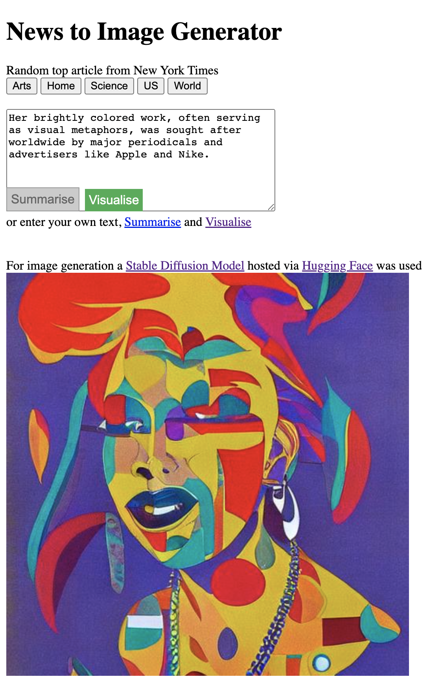

# News2Img
This project got founded in the course **Digital Creativity** at HSLU.

#### Student working on the project: [Martin Zwifl](https://github.com/martin-zwifl)

## Target :dart:
I already had experience with training and fine-tuning Machine Learning models, but I never really worked with something front-end related. So with this project my goal was to deploy given models, build-up a simple User Interface (UI) to make it accessible and host the website somewhere to be publically accessible. For the UI, I wanted to concentrate on API calls to access either the deployed models or publically accessible data bases.

## Idea :bulb:
As I read about stable diffusion models (image generation) multiple times before, I wanted to include such a model in my project. But the input should not be random vectors, but rather *real world data*. So I decided to use news articles. In order to reduce the input size for the stable diffusion model, my idea was to use a text-summarisation model (e.g., a transformer model) in order to scale it down.

## Process :books:
After some research I started to collect interesting APIs and tools for the project.

#### Hosting webpage
In the beginning, I thought about setting up a [Raspberry Pi](https://www.raspberrypi.com/) to host the website. After some research and setting things up, I found out that the port forwarding was not possible with my internet connection. Luckily I moved on to [GitHub Pages](https://pages.github.com/), which I really like by now. It is also straight-f to also play around with Continous Deployment (CD) and Continous Integration (CI) there.

#### Deploy models
My first incentive was here also to deploy my models on a Raspberry Pi, but after the troubles with port forwarding I didn't continue this track. Of course I knew it would not perform good, but it is something I wanted to try at some point.
As we digged quite a bit into the functionalities of Hugging Face during the lecture, I decided to use the APIs of models provided and additionally, deploy my own. I also got the information that one could apply for a community sponsored GPU [Space on Hugging Face](https://huggingface.co/docs/hub/spaces-gpus) to deploy larger models. Nevertheless, I ended-up using the free CPU-only version to deploy a smaller model as it performed well enough for my needs.

#### Choosing of models
In the first place, I played around with summarisation models of the [Hugging Face transformer pipeline](https://huggingface.co/docs/transformers/main_classes/pipelines#transformers.pipeline:~:text=%23%20%7B%22text%22%3A%20....%7D%0A%20%20%20%20%23%20....-,transformers.pipeline,-%3C) in a Jupyter Notebook. Regarding stable diffusion, I got the  - to me - best looking results with stable diffusion [model from DeepAI](https://deepai.org/machine-learning-model/stable-diffusion). This one is somehow very limited in the free version regarding number of API calls. Therefore, I finally decided for a popular [stable diffusion model on Hugging Face](https://huggingface.co/runwayml/stable-diffusion-v1-5) to process my texts to images.

#### Choosing News API
As I needed some source of articles, I tried multiple APIs recommended on the internet. From most of them I got Cross-Origin Resource Sharing (CORS) errors and unfortunately I was not able to fix them. I also failed on the trial of using a proxy server in between to avoid those. Our lecturer finally advised me to use the [New York Times API](https://developer.nytimes.com/apis) as he had good experience with this one. I tried it right after and it worked like a charm, therefore I selected it for the final prototype.

## Webapplication :computer:
So the outcome of this project is a web application using mainly Javascript and a few lines of static HTML code.
There are two main ways of using my prototype. 

**1st** the user can select one of the five given categories {Arts, Home, Science, US, World}. By clicking on one of them, a GET request to [New York Times API](https://developer.nytimes.com/docs/most-popular-product/1/overview) is sent. It retrieves a list of popular news articles from the category selected. Automatically, a random one gets picked and its abstract is shown in the textbox. Furthermore, this text is input of an upfollowing POST request to the deployed [stable diffusion model](https://huggingface.co/runwayml/stable-diffusion-v1-5). With the receival of the response, the generated image is displayed right below. I also linked the resources used on the website.

**2nd use case** is inserting a chosen news article or text of choice in the textbox. In case of longer texts, one could make use of the [summarisation model](https://huggingface.co/pszemraj/long-t5-tglobal-base-16384-book-summary) by clicking the "Summarise" button. This triggers again a POST request to the summarisation API stated before. When successful, the textbox content gets replaced by its summarisation. Afterwards, when happy with the new textbox content, one can finally generate the image again as described before in 1st usecase, by pressing "Visualise". :tada:

**Example**


## Error handling :electric_plug:
As APIs cannot be guaranteed to work 100% of all time, I implemented some error handling. For example the models deployed via Hugging Face need to be loaded in case no one used them for a specified period of time. In this case the server responds with an Error and an estimated time when the model will be loaded. Therefore, I implemented a custom progress bar to indicate the time needed.


During waiting for responses a different process indicator is shown as well.
In case of real errors, I decided to use the alert function to inform the user about what went wrong.

### Project setup
As the source code is already public with the website itself you could just copy the index.html, also containing all Javascript. Or you can clone the git repository by executing the following in your terminal
```sh
git clone https://github.com/martin-zwifl/news2img
```
When you want to host this, you can use any hosting platform of your choice or stick to Github pages as refered above.


## References
* [Prototype website](https://martin-zwifl.github.io/news2img/)
* [GitHub pages doku](https://pages.github.com/)
* [Spaces on Hugging Face](https://huggingface.co/docs/hub/spaces-gpus)
* [Hugging Face transformer pipeline](https://huggingface.co/docs/transformers/main_classes/pipelines#transformers.pipeline:~:text=%23%20%7B%22text%22%3A%20....%7D%0A%20%20%20%20%23%20....-,transformers.pipeline,-%3C)
* [Stable diffusion model from DeepAI](https://deepai.org/machine-learning-model/stable-diffusion)
* [Used stable diffusion model on Hugging Face](https://huggingface.co/runwayml/stable-diffusion-v1-5)
* [New York Times APIs](https://developer.nytimes.com/apis)
* [Summarisation model](https://huggingface.co/pszemraj/long-t5-tglobal-base-16384-book-summary)
* [Authors Github](https://github.com/martin-zwifl)
* [Raspberry Pi](https://www.raspberrypi.com/)